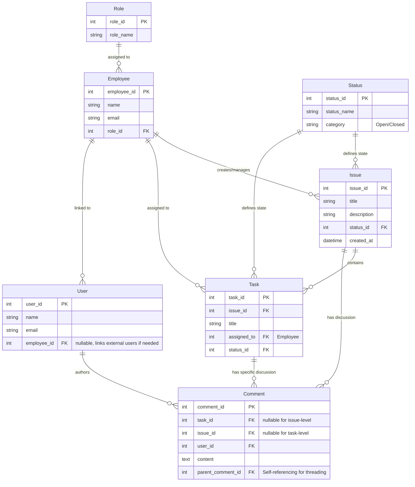

# Issue Tracker Architecture Design

## 1. High-Level System Architecture

This application follows a **Clean Architecture** approach with a separation of concerns. This ensures long-term maintainability, testability, and flexibility.

### Layers
1.  **Presentation Layer (Frontend)**: React (Vite) + Tailwind CSS application. It consumes APIs and handles user interactions. It knows *nothing* about the database.
2.  **API Layer (Backend Entry)**: ASP.NET Core Web API controllers. They receive HTTP requests, validate inputs, and call the Application Layer.
3.  **Application Layer (Business Logic)**: Services and DTOs. This contains the "rules" of the system (e.g., "Issues cannot be closed if they have open tasks"). It orchestrates data flow.
4.  **Domain Layer (Core)**: Entities (`Issue`, `Task`, `Employee`) and Interfaces. This is the heart of the system. It has NO dependencies on other layers.
5.  **Infrastructure Layer (Data Access)**: Entity Framework Core, Repository implementations, and Database configurations. This layer talks to MySQL.

### Data Flow
`User Action` -> `React Code` -> `API Controller` -> `Service` -> `Repository` -> `Database`

---

## 2. Database Schema & Models

We use a **Normalized Relational Schema** (3NF) in MySQL.

### Core Entities & Relationships



### Key Design Decisions
1.  **Dynamic Roles**: `Role` table allows adding "Manager", "Client", "QA" without code changes.
2.  **Status Table**: Instead of an Enum, we use a `Status` table. This lets admin users add new states like "In QA Review" or "Blocked" dynamically in the future.
3.  **Threaded Comments**: `parent_comment_id` allows infinite nesting of replies.
4.  **Separation of User/Employee**: Allows the system to support external users (Clients) who report issues but aren't employees.

---

## 3. Dynamic Roles Implementation

**The Problem**: Hardcoding `if (user.Role == "Admin")` is brittle. If we add "SuperAdmin", we have to recompile and deploy.

**The Solution**: Database-Driven Permissions.

1.  **Database**:
    We already have `Role` and `Employee`.
    We can add a `Permission` table and `RolePermission` join table.
    *   `Permission`: { "permission_id": 1, "code": "ISSUE_CREATE" }
    *   `RolePermission`: { "role_id": 1 (Dev), "permission_id": 1 }

2.  **Backend Check**:
    Instead of checking role names, checks specific permissions.
    ```csharp
    // BAD
    if (user.Role == "Manager") { ... }

    // GOOD
    if (user.HasPermission("ISSUE_CLOSE")) { ... }
    ```
    *Note: For this initial scaffold, we will implement the Role relationship first, but keep this permission expansion in mind.*

---

## 4. Lifecycle Management (Business Logic)

### Issue Lifecycle
1.  **Created**: Status = "Open". No tasks required yet.
2.  **In Progress**: Automatically moves here if a Task is started? Or manual? *Design Choice: Manual transition for flexibility.*
3.  **Closed**: Can only be closed if ALL tasks are "Closed" or "Cancelled". (**Constraint Enforcement**)

### Task Lifecycle
1.  **Created**: Status = "Open". Linked to an Issue.
2.  **Assigned**: Linked to an Employee.
3.  **Closed**: Work is done.

### The "New Task on Closed Issue" Edge Case
If an Issue is "Closed", and a user adds a new Task:
*   **Logic**: The Issue status MUST automatically revert to "In Progress" or "Reopened".
*   This prevents "Closed" issues from having "Open" work hidden inside them.

---

## 5. API Design (RESTful)

### Issues
*   `GET /api/issues`: List all issues (supports filtering).
*   `GET /api/issues/{id}`: Detailed view (includes task summary).
*   `POST /api/issues`: Create new.
*   `PUT /api/issues/{id}/status`: Change status (Triggers validation logic).

### Tasks
*   `GET /api/issues/{id}/tasks`: Get tasks for an issue.
*   `POST /api/tasks`: Create task (Updates parent Issue status if needed).
*   `PUT /api/tasks/{id}/assign`: Assign employee.

### Comments
*   `GET /api/tasks/{id}/comments`: Threaded view.
*   `POST /api/comments`: Add comment (Reply uses `parentId`).

### Reports
*   `GET /api/reports/dashboard`: Aggregated stats (Open issues count, etc).

---

## 6. Project Structure Map

```text
/backend
  /src
    /Domain          (Entities: Issue.cs, Task.cs)
    /Application     (Services: IssueService.cs, DTOs)
    /Infrastructure  (Data: AppDbContext.cs, Repositories)
    /API             (Controllers: IssuesController.cs)
/frontend
  /src
    /components      (UI: Button.tsx, StatusBadge.tsx)
    /pages           (Views: Dashboard.tsx, Detail.tsx)
    /services        (Network: api.ts)
    /types           (Definitions: index.ts)
```
